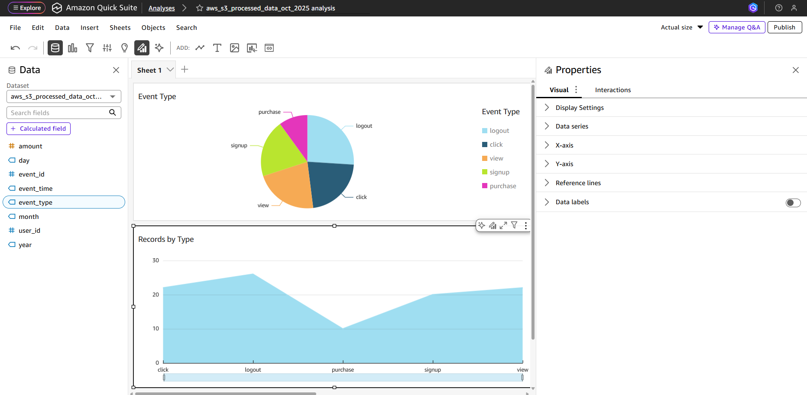

# 🚀 AWS Serverless Data Pipeline Project

A simple end-to-end **data engineering pipeline** built entirely with **AWS Serverless services**.  
This project demonstrates how to automatically process, clean, and analyze event data using **Lambda, S3, Glue, Athena,** and **QuickSight** — without managing any servers.

---

## 🧩 Architecture Overview

**Services used:**
- **Amazon S3** – stores raw and processed data  
- **AWS Lambda** – automatically triggered when new data arrives, cleans & writes output  
- **AWS Glue** – catalogs processed data for easy querying  
- **Amazon Athena** – runs SQL queries on top of processed S3 data  
- **Amazon QuickSight** – visualizes insights from Athena queries  

---

## 📊 Data Flow Diagram

```text
S3 (raw events) 
   │
   ▼
Lambda Function (cleans CSV)
   │
   ▼
S3 (processed)
   │
   ▼
Glue Crawler → Glue Catalog → Athena → QuickSight
```
### ⚙️ How It Works

Upload raw CSV (e.g., events_sample.csv) to the raw S3 bucket.
Example bucket: my-datapipeline-raw-data/

S3 triggers the Lambda function.

Lambda reads the file, filters out missing or invalid rows, and writes a cleaned version to:

```

my-datapipeline-processed-data/year=2025/month=10/day=14/         

```

AWS Glue Crawler runs and detects the schema.

Athena queries the processed data using SQL.

QuickSight visualizes trends (e.g., total purchases, user activity).

### 🧠 Lambda Function Overview
Main Steps

Triggered by S3 event

Downloads CSV from the raw bucket

Cleans data (removes invalid rows, fills missing values)

Uploads cleaned CSV to the processed bucket

### 🧰 AWS Setup Steps
1. Create S3 Buckets

my-uniquebucket-raw-data

my-uniquebucket-processed-data

2. Create Lambda Function

Runtime: Python

Upload lambda_function.py

Add S3 trigger for my-uniquebucket-raw-data

3. Attach IAM Role

Use a role with:

S3 read/write

CloudWatch logs

4. Create AWS Glue Crawler

Source: processed bucket

Target database: data_pipeline_db - Will be created by glue 

5. Query in Athena

Example:

```

SELECT event_type, COUNT(*) AS events, SUM(amount) AS total_sales
FROM "data_pipeline_db"."processed_data"
GROUP BY event_type;

```


6. Visualize in QuickSight

Connect QuickSight to Athena

Build dashboards for user behavior, revenue, etc.

 

### 🧰 Tools Used

AWS Lambda

Amazon S3

AWS Glue

Amazon Athena

Amazon QuickSight

Python (pandas, boto3)

### Future Improvments
1. Implementing Infrastructure as Code
2. Instead on manually running Glue data crawler can automate using Lambda
3. Add SNS notifications for data processing failures
